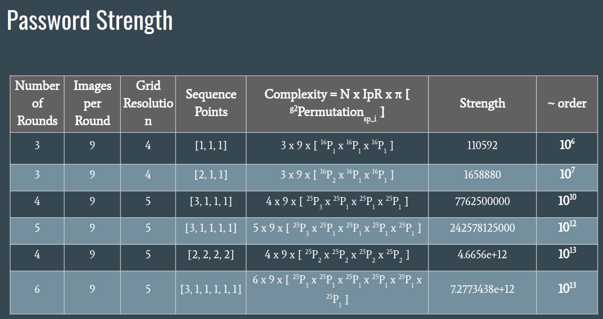
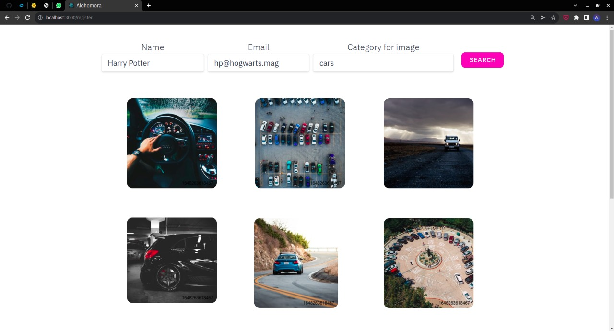
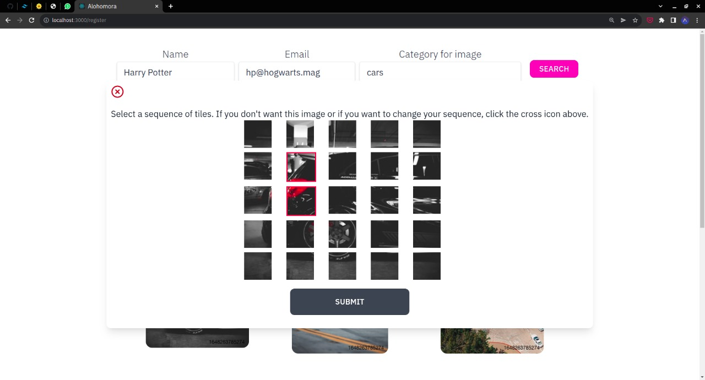
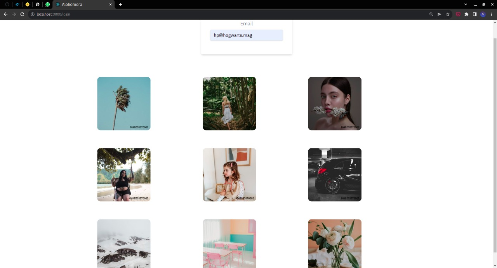
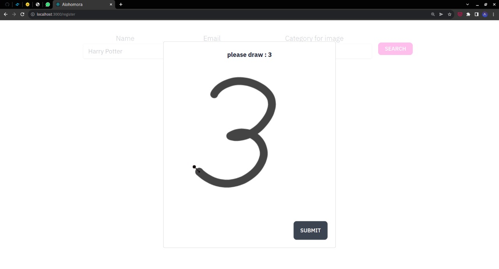

# Grpahical Password Authentication

# Alohomora

Harry Potter themed (not really) Graphical Password Authentication  
**[Flowchart and Architecture](https://whimsical.com/getting-started-boards-LARZb8hL94L9b6R1s1JPb2)**



## Team members

- Arnav Shah - asshah_b18@it.vjti.ac.in
- Akshat Shah - shahakshat2000@gmail.com
- Crehan Santhumayor - crehanas14@gmail.com
- Devanshi Shah - devanshi1500@gmail.com
- Ganadhish Acharekar - acharekarganadhish1999@gmail.com
- Saharsh Jain - saharshjain2000@gmail.com

## Description

**Background**: Passwords are ubiquitous today on any platform, on possibly any website. But to remember so difficult passwords and that too on numerous websites seems daunting and therefore you can devise a project illustrating graphical password strategy. This will allow the user to set passwords in the form of graphical presentation in a certain pattern and later use that pattern to login on the system.

**Summary**: Remembering numerous passwords from various different sites can be difficult for a user. So to provide some flexibility we can provide users a graphical password authentication system where instead of creating a password a user has to select graphical objects in a particular order to keep it as their password.

**Objective**: In this method, the user is required to select some images (let’s say different chocolates) in a specific pattern (for example dairy milk is followed by 5 stars which is in turn followed by KitKat and so on). Next time the user tries to log in, the images would have been shuffled, but the user will be required to follow the same pattern which was used initially. Every time the user will have to use the same sequence while the images are placed in different ways. This type of authentication is difficult to break since neither brute force nor dictionary attacks could breach it. We need techniques that can be easily implemented and provide better results to this process.

- Graphical Password with multiple rounds of security
- Combination of Recognition based and Cue Based Graphical Password
- Competitive strength to alphanumeric passwords with additional advantages like No Dictionary attacks, difficult brute force attacks, etc
- Use of Hashes and Encryption algorithms for secure storage of data
- An attempt to make this new type of passwords rememberable with image captionining and keywords prompts

## Links

- GitHub Repo link: [Alohomora](https://github.com/akshatshah21/Alohomora/)

## Technology stack

1. Node JS
2. React
3. Tailwind CSS
4. Daisy UI
5. Python
6. HuggingFace
7. Spacy
8. MongoDB

## Project Setup

### Installing Dependencies

```
git clone https://github.com/akshatshah21/Alohomora.git

cd client/
npm i

cd server/
npm i

cd flask_server/
pip install -r requirements.txt
python -m spacy download en
```

### Environment Variables

**/server/.env**

```
UNSPLASH_ACCESS_KEY = your_key_for_unsplash_api
MONGODB_URL = your_mongo_atlas_url
NUM_IMAGES_PER_SET = try 9
TOTAL_ITERATIONS = try 4
PORT = try 4000
```

**/client/.env**

```
REACT_APP_UNSPLASH_ACCESS_KEY = your_unsplash_api_key
REACT_APP_NUM_TILES
REACT_APP_NUM_ROUNDS
```

## Usage

In three different terminals:

```
cd server
npm start
```

```
cd client
npm start
```

```
cd flask_server
python server.py
```

## Applications

Humans have greater ability to remeber images rather than complex alphanumeric passwords. Graphical scheme was introduced as a variation to the login/password scheme. It can improve the security of user
authentication over that provided by textual passwords. They are immune to the common attacks suffered by other authentication schemes like dictionary attacks or brute force attacks.

## Future scope

1. Convert selected sequence of images to a rememberable sentence, and prompt questions based on that sentence during login
2. Captcha based Password Auth
3. Develop Extension to add graphical password for any website
4. Change parameters according to password strength selected by the user

## Screenshots





